# Player Attacks

All docs in `Docs/` are design references. They describe current intent, not
final decisions, and should be revisited in detail before implementation locks in.

## Runtime Model

Player attacks are loadout-driven scene-object components that submit gameplay
work into data runtimes. The player, attack slots, and authored prefabs are
GameObjects. Active projectiles are ECS entities owned by scoped
`ProjectileRoot` instances, not projectile GameObjects.

Current player attack flow:

1. `PlayerRoot` finds attack components under the configured `Attacks` child.
2. `PlayerAttackLoadout` keeps standalone `ProjectileAttack`, `AoeAttack`, and
   `ChildSpawningProjectileAttack` entries up to `maxAttackCount`.
3. Holding primary fire asks every ready equipped attack to fire in the same
   frame.
4. Attack components snapshot authored data into spawn commands.
5. Scoped roots simulate hits and replay results back to scene actors.

Editor authoring dependency graph:

```mermaid
graph TD
    MainScene["Main scene"]
    PlayerPrefab["Player prefab"]
    AttacksChild["Attacks child"]
    ProjectileAttackPrefab["ProjectileAttack prefab"]
    ChildAttackPrefab["ChildSpawningProjectileAttack prefab"]
    PulseAoeAttackPrefab["Pulse AoeAttack prefab"]
    LingeringAoeAttackPrefab["Lingering AoeAttack prefab"]
    ProjectileConfig["ProjectileConfig asset"]
    ParentConfig["parent ProjectileConfig asset"]
    ChildConfig["child ProjectileConfig asset"]
    PulseAoeConfig["pulse AoeConfig asset"]
    LingeringAoeConfig["lingering AoeConfig asset"]
    ProjectileTemplate["BasicAttackPrefab projectile template"]
    PulseAoeTemplate["BasicAoePrefab pulse template"]
    LingeringAoeTemplate["BasicAoePrefab lingering template"]
    HitEffectDef["ProjectileHitEffectDefinition asset"]
    StatusTriggerDef["StackingTriggerDef asset"]
    PlayerProjectileRoot["PlayerProjectileRoot scene object"]
    PlayerAoeRoot["AoeRoot_PlayerToMob scene object"]
    GameRoot["GameRoot scene object"]
    MobSpawnerRoot["MobSpawnerRoot scene object"]
    AudioClip["AudioClip asset"]
    AudioManager["AudioManager scene object"]

    MainScene --> GameRoot
    MainScene --> PlayerPrefab
    MainScene --> PlayerProjectileRoot
    MainScene --> PlayerAoeRoot
    MainScene --> MobSpawnerRoot
    MainScene --> AudioManager

    PlayerPrefab --> AttacksChild
    AttacksChild --> ProjectileAttackPrefab
    AttacksChild --> ChildAttackPrefab
    AttacksChild --> PulseAoeAttackPrefab
    AttacksChild --> LingeringAoeAttackPrefab

    ProjectileAttackPrefab --> ProjectileConfig
    ProjectileAttackPrefab --> HitEffectDef
    ProjectileAttackPrefab --> PlayerProjectileRoot
    ProjectileAttackPrefab --> PlayerAoeRoot
    ProjectileAttackPrefab --> AudioClip
    ProjectileAttackPrefab --> AudioManager

    ChildAttackPrefab --> ParentConfig
    ChildAttackPrefab --> ChildConfig
    ChildAttackPrefab --> HitEffectDef
    ChildAttackPrefab --> PlayerProjectileRoot
    ChildAttackPrefab --> PlayerAoeRoot
    ChildAttackPrefab --> AudioClip
    ChildAttackPrefab --> AudioManager

    PulseAoeAttackPrefab --> PulseAoeConfig
    PulseAoeAttackPrefab --> PlayerAoeRoot
    PulseAoeAttackPrefab --> AudioClip
    PulseAoeAttackPrefab --> AudioManager

    LingeringAoeAttackPrefab --> LingeringAoeConfig
    LingeringAoeAttackPrefab --> PlayerAoeRoot
    LingeringAoeAttackPrefab --> AudioClip
    LingeringAoeAttackPrefab --> AudioManager

    ProjectileConfig --> ProjectileTemplate
    ParentConfig --> ProjectileTemplate
    ChildConfig --> ProjectileTemplate
    PulseAoeConfig --> PulseAoeTemplate
    LingeringAoeConfig --> LingeringAoeTemplate
    HitEffectDef --> StatusTriggerDef

    GameRoot --> PlayerProjectileRoot
    GameRoot --> PlayerAoeRoot
    GameRoot --> MobSpawnerRoot
    MobSpawnerRoot --> PlayerProjectileRoot
    MobSpawnerRoot --> PlayerAoeRoot
```

Pulse and lingering AOEs may both use the `AoeAttack` component type, but they
should be authored as separate attack prefabs with separate `AoeConfig` assets.
Pulse configs use `lifetimeSeconds = 0`; lingering configs use a positive
`lifetimeSeconds` and authored `tickIntervalSeconds`.

Multiple firing points should be authored as multiple child attack prefabs with
different local positions. The attack GameObject Transform is the firing offset.
Do not add a second hidden spawn-offset field unless a future weapon truly needs
one.

## Asset Locations

Use these folders for current content:

- `Assets/Prefabs/Player/`: player prefab and its `Attacks` child
- `Assets/Prefabs/Attacks/`: equipped attack container prefabs
- `Assets/Prefabs/Projectiles/`: projectile visual/collision templates
- `Assets/ScriptableObjects/Attacks/`: `ProjectileConfig` and `AoeConfig` assets
- `Assets/ScriptableObjects/StatusEffects/`: `StackingTriggerDef` and `StackingDoTDef` assets
- `Assets/Audio/`: attack sound clips

## Projectile Template Authoring

A projectile template is a prefab with `BasicAttackPrefab` on the root. It is
the source for projectile render and collision baking.

Required structure:

- root GameObject: `BasicAttackPrefab`
- child named `Visual`: `SpriteRenderer`
- child named `Hurtbox`: `CircleCollider2D`, `BoxCollider2D`, or `CapsuleCollider2D`

Rules:

- `Visual` must have a sprite.
- `Visual` must use a material with GPU instancing enabled.
- `Hurtbox` defines the projectile hit shape, radius, extents, and rotation.
- Template colliders are authoring data only; high-count projectile hits use ECS
  snapshots and baked shapes.

## Projectile Config Authoring

Create projectile config assets with:

`Assets > Create > PlayGround > Attack > Projectile Config`

`ProjectileConfig` is the single authoring source for projectile behavior. The
same type is used for parent projectiles and child projectiles.
Attack cadence is owned by attack MonoBehaviours, not projectile configs.

Fields:

- `basicPrefab`: `BasicAttackPrefab` projectile template
- `speed`: projectile travel speed
- `lifetime`: seconds before despawn
- `damage`: direct hit payload damage
- `count`: number of projectiles in one authored volley
- `spreadDegrees`: total volley spread
- `jitterDegrees`: random aim offset after spread
- `targetMask`: target mask override; leave as `1` for scoped root default
- `pierceCount`: number of extra hits before disable
- `repeatHitCooldownSeconds`: same-target repeat hit gate for pierce
- `trackingEnabled`: enables homing steering
- `trackingRange`: max target acquisition range
- `trackingTurnSpeedDegrees`: turn rate per second
- `trackingQueryIntervalSeconds`: reacquire cadence
- `trackingInitialQueryDelaySeconds`: first acquire delay, useful for staggering
- `directDamageEnabled`: whether target actors apply direct payload damage
- `impactAoeTypeId`: `-1` disables impact AOE; non-negative requests AOE spawn
- `impactAoeDamage`: damage used by impact AOE request
- `impactAoeLifetimeSeconds`: impact AOE lifetime
- `impactAoeTickIntervalSeconds`: impact AOE tick cadence

Target mask convention:

- Use `1` for normal content so attack components and child spawners use the
  owning `ProjectileRoot.TargetMask`.
- Use an explicit mask only for special content that intentionally targets a
  different target set.
- Player projectile roots should target mob hurtboxes.
- Mob projectile roots should target player hurtboxes.

## Basic Projectile Attack Authoring

Use `ProjectileAttack` for a direct projectile volley.

Required component fields:

- `projectileRoot`: optional when scene tags are correct; explicit reference is
  preferred for scene-authored instances
- `config`: required `ProjectileConfig`
- `recoverySeconds`: cooldown after each fired volley
- `performSound`: optional clip
- `audioManager`: optional, resolved through `AudioManager.Instance` when blank
- `aoeRoot`: optional, required for impact AOE or hit effects that request AOEs

Authoring steps:

1. Create or reuse a `BasicAttackPrefab` projectile template.
2. Create a `ProjectileConfig` asset and assign the template.
3. Set speed, lifetime, damage, count, spread, jitter, pierce, and tracking.
4. Create an attack prefab under `Assets/Prefabs/Attacks/`.
5. Add `ProjectileAttack` and assign the config.
6. Assign `projectileRoot` if this prefab is scene-specific; otherwise ensure
   the scene root is tagged `PlayerProjectileRoot` or `MobProjectileRoot`.
7. Put the attack prefab under the player's `Attacks` child.
8. Move the attack Transform to the desired firing point.

Volley rules:

- `count = 1` fires straight toward aim direction.
- `count > 1` distributes shots evenly across `spreadDegrees`.
- `jitterDegrees` applies after spread placement.
- All shots originate from the attack Transform position.

Example:

- `count = 3`
- `spreadDegrees = 30`
- shots fire at `-15`, `0`, and `+15` degrees before jitter

## Child-Spawning Attack Authoring

Use `ChildSpawningProjectileAttack` when a parent projectile should emit more
projectiles over time. The parent projectile and spawned child projectiles are
both configured through `ProjectileConfig` ScriptableObjects on the same attack
component.

Prefab structure:

- root GameObject: `ChildSpawningProjectileAttack`

Root fields:

- `projectileRoot`: optional when scene tags are correct; explicit reference is
  preferred for scene-authored instances
- `parentConfig`: `ProjectileConfig` used for the parent projectile volley
- `childConfig`: `ProjectileConfig` used for spawned child projectiles
- `recoverySeconds`: cooldown after each fired parent volley
- `performSound`: optional clip
- `audioManager`: optional, resolved through `AudioManager.Instance` when blank
- `aoeRoot`: optional, required for impact AOE or hit effects that request AOEs
- `childProjectileCount`: children created per spawn tick
- `childSpawnIntervalSeconds`: seconds between child spawn ticks
- `childSpawnIntervalJitterSeconds`: deterministic per-parent offset
- `childSideSpreadDegrees`: side-spray spread around the parent perpendicular

Child config rules:

- Parent projectile visual, collision, speed, lifetime, damage, count, spread,
  jitter, pierce, direct damage, impact AOE, and tracking come from
  `parentConfig`.
- Child projectile visual, collision, speed, lifetime, damage, pierce, direct
  damage, and tracking come from `childConfig`.
- Child spawner count and interval come from `ChildSpawningProjectileAttack`.
- Attack fire recovery comes from `ChildSpawningProjectileAttack.recoverySeconds`.
- Parent projectiles spawn from the `ChildSpawningProjectileAttack` GameObject
  Transform. There is no `ParentProjectile` child object and no nested
  `ProjectileAttack` for this attack type.
- Leave child `targetMask` as `1` unless the child intentionally uses a special
  target set; root default mask will be applied.
- Child tracking is copied into ECS through `ProjectileChildSpawnerComponent`.

Current child spawn pattern:

- `SideSpray` is used by `ChildSpawningProjectileAttack`.
- Even child indices fire to the left side of parent travel direction.
- Odd child indices fire to the right side.
- Each side fans across `childSideSpreadDegrees`.

## Basic AOE Attack Authoring

Use `AoeAttack` when the player should place pulse AOEs through the scoped AOE
runtime.

Required scene setup:

- `AoeRoot_PlayerToMob`: scene object with `AoeRoot`
- `AoeRoot_PlayerToMob.targetMask`: set to `MobHurtbox`
- `GameRoot.playerAoeRoot`: assigned to `AoeRoot_PlayerToMob`
- `MobSpawnerRoot.playerAoeRoot`: assigned to `AoeRoot_PlayerToMob` so spawned
  mobs register as AOE targets

Required `AoeAttack` fields:

- `aoeRoot`: assigned to the player-to-mob AOE root
- `recoverySeconds`: cooldown after each cast
- `config`: required `AoeConfig`
- `performSound`: optional clip
- `audioManager`: optional, resolved through `AudioManager.Instance` when blank

Required `AoeConfig` fields:

- `typeId`: AOE type id registered with the root by `AoeAttack`
- `basicPrefab`: `BasicAoePrefab` AOE template
- `sizeMultiplier`: uniform scale applied after prefab Transform scale to both
  visual sprite size and hurtbox collision size
- `damage`: damage payload for each hit
- `lifetimeSeconds`: `0` for current pulse AOEs
- `tickIntervalSeconds`: unused by current pulse AOEs
- `count`: number of AOEs spawned per cast
- `spawnAtAimPosition`: spawn at mouse/world aim position; when false, spawn at
  the attack Transform position
- `targetMask`: leave as `1` to use the owning root mask

Basic pulse example:

- template prefab: `Assets/Prefabs/Effects/BasicAoePulse.prefab`
- config asset: `Assets/ScriptableObjects/Attacks/BasicAoeConfig.asset`
- attack prefab: `Assets/Prefabs/Attacks/BasicAoeAttack.prefab`
- `typeId = 0`
- `spawnAtAimPosition = true`
- `lifetimeSeconds = 0`
- `count = 1`

## Equipping On Player

The player prefab should have:

- `PlayerRoot.attacksRoot` assigned to the `Attacks` child
- attack prefab instances under `Attacks`
- `maxAttackCount` high enough to include desired attacks

Loadout selection order is:

1. standalone `ProjectileAttack`
2. `AoeAttack`
3. `ChildSpawningProjectileAttack`

`ProjectileAttack` and `ChildSpawningProjectileAttack` are separate equipped
attack components. Do not add a child-spawning parent projectile as a nested
`ProjectileAttack`; put the parent projectile config in `parentConfig`.

When adding an attack to the player:

1. Drag the attack prefab under `Player/Attacks`.
2. Enable the attack component instance if the prefab keeps components disabled
   for authoring.
3. Assign scene-specific roots if needed.
4. Set local position for muzzle offset.
5. Confirm `maxAttackCount` includes the new slot.

## Scoped Roots

`ProjectileAttack` and `ChildSpawningProjectileAttack` resolve projectile roots
in this order:

1. explicit `projectileRoot` field
2. tagged scene root based on owner type

For player attacks, the scene should contain a root tagged
`PlayerProjectileRoot`. For mob attacks, the scene should contain a root tagged
`MobProjectileRoot`.

Root defaults:

- `PlayerProjectileRoot` targets `MobHurtbox` and uses `PlayerProjectile` layer
- `MobProjectileRoot` targets `PlayerHurtbox` and uses `MobProjectile` layer

## Hit Effects And AOEs

Projectile attack components can reference reusable `ProjectileHitEffectDefinition`
ScriptableObjects. Legacy child `ProjectileHitEffect` components are still
supported for local one-off content.
On hit:

- direct damage is handled through the projectile payload when enabled
- impact AOE is requested when `impactAoeTypeId >= 0`
- hit effects may request additional AOEs through the configured `AoeRoot`

Hit effects should read snapshotted hit context and request explicit runtime
effects. They should not mutate active projectile ECS data or run broad scene
searches.

## Stacking Explosion Attack Authoring

Use `ProjectileAttack` with a `ProjectileStatusEffectHitEffectDefinition` when
projectile hits should accumulate stacks on a target and explode at a threshold.
The projectile hit effect only applies stacks. The target's `StatusEffects`
component owns the threshold trigger, and `MobRoot` emits the explosion through
the same scoped `AoeRoot` used by direct AOE attacks.

Four authored assets are required in addition to the normal projectile template:

- `StackingTriggerDef` — how many stacks trigger one explosion, which AOE type
  fires, and how much damage that explosion carries
- `AoeConfig` — explosion visual, shape, and size
- `ProjectileConfig` — the carrier projectile

- `ProjectileStatusEffectHitEffectDefinition` - stack application payload

### Authoring steps

1. Create a `StackingTriggerDef` asset via
   `Assets > Create > PlayGround > Status Effects > Stacking Trigger`.
   Set `stackThreshold` to the hit count needed for one explosion.
   Set `triggerAoeTypeId`, `triggerAoeDamage`, `triggerAoeLifetimeSeconds`, and
   `triggerAoeTickIntervalSeconds` for the mob-owned explosion.

2. Create or reuse a `BasicAoePrefab` prefab for the explosion visual (same
   structure as any AOE template: root has `BasicAoePrefab`, `Visual` child
   has `SpriteRenderer`, `Hurtbox` child has a `Collider2D`).

3. Create an `AoeConfig` asset via
   `Assets > Create > PlayGround > Attack > AOE Config`. Required fields:
   - `typeId`: unique integer not in use by any other `AoeConfig` on the same
     `AoeRoot`
   - `basicPrefab`: the explosion `BasicAoePrefab`
   - `sizeMultiplier`: uniform scale applied after prefab Transform scale to
     explosion radius and visual
   - `lifetimeSeconds`: `0` for a one-frame pulse; positive for a lingering area
   - `damage`: leave at `0`; explosion damage is owned by the hit effect field
     `triggerAoeDamage`, not by the config

4. Register the explosion AOE type with the scene `AoeRoot` that the attack
   will use. Add the `AoeConfig` to `AoeRoot.aoeTypes` directly, or equip an
   `AoeAttack` that references the same config (which registers it on `Awake`).

5. Create a `ProjectileStatusEffectHitEffectDefinition` asset via
   `Assets > Create > PlayGround > Attack > Hit Effects > Status Effect AOE Trigger`.
   Required fields:
   - `effectDef`: the `StackingTriggerDef`
   - `stacksPerHit`: stacks applied per hit (usually `1`)
   The projectile effect does not own explosion data.

6. Create a `ProjectileConfig` for the carrier projectile. The stacking pattern
   does not require specific values, but typical choices:
   - `directDamageEnabled = false` when all damage should come from the explosion
   - `impactAoeTypeId = -1` so the projectile does not also spawn an impact AOE
   - `count`, `speed`, `spread`, and `lifetime` tuned for the intended hit rate

7. Create an attack prefab under `Assets/Prefabs/Attacks/`. Add
   `ProjectileAttack` to the root. Assign:
   - `config`: the carrier `ProjectileConfig`
   - `hitEffectDefinitions`: the stacking explosion hit effect asset
   - `projectileRoot`: scoped projectile root, or leave blank if scene tag is set
   - `aoeRoot`: the `AoeRoot` the explosion config is registered on

8. Add a `StatusEffects` component to every target prefab (`MobRoot`,
   `PlayerRoot`) that should receive stacks. It is a sibling component; no
   fields require configuration.

9. Place the attack prefab under `Player/Attacks` and confirm
   `PlayerRoot.maxAttackCount` covers the new slot.

### Damage model

Damage is snapshotted into the debuff at hit time from the `StackingTriggerDef`.
Each applied stack carries `triggerAoeDamage / stackThreshold` as its contribution.
When stacks reach the threshold, the accumulated contributions fire as one
explosion. Stacks above the threshold remain and begin charging the next cycle;
partial cycles carry their proportional damage forward.

Two stacks from different sources or attack power levels will blend proportionally
in the accumulator: the explosion damage reflects the average power of whatever
hits built it up.

## Validation Checklist

Before playtesting a new projectile attack:

- `BasicAttackPrefab` validates in `Awake()` and `OnValidate()`
- template `Visual` child has sprite and instanced material
- template `Hurtbox` child uses supported 2D collider
- `ProjectileConfig.basicPrefab` is assigned
- basic projectile attacks have `ProjectileAttack.config` assigned
- child-spawning attacks have both `parentConfig` and `childConfig` assigned
- attack is under `Player/Attacks`
- attack component is enabled in the scene/prefab instance
- player `maxAttackCount` includes the attack
- projectile root target layers and tags match intended targets
- tracking configs have nonzero range and turn speed when tracking is expected
- child configs use target mask `1` unless a special mask is intentional

Before playtesting a new stacking explosion attack:

- `ProjectileAttack.hitEffectDefinitions` includes the stacking explosion hit effect asset
- `effectDef` is a `StackingTriggerDef` with `stackThreshold >= 1`
- `StackingTriggerDef.triggerAoeTypeId` matches the `AoeConfig.typeId` registered on the `AoeRoot`
- `StackingTriggerDef.triggerAoeDamage > 0`
- `ProjectileAttack.aoeRoot` is assigned to the same root the explosion config is registered on
- explosion `AoeConfig.basicPrefab` is assigned
- explosion `AoeConfig.lifetimeSeconds = 0` for a pulse
- `StatusEffects` component present on every target mob prefab
- `ProjectileConfig.directDamageEnabled = false` if carrier projectile deals no direct damage

Before playtesting a new AOE attack:

- template prefab root has `BasicAoePrefab`
- template prefab has `Visual` child with a `SpriteRenderer`
- template prefab has `Hurtbox` child with a supported `Collider2D`
- template prefab root, `Visual`, and `Hurtbox` Transform scale participates in
  baked AOE size
- AOE collision size is the scaled `Hurtbox` child collider multiplied by
  `AoeConfig.sizeMultiplier`
- AOE render size is the sprite Transform scale multiplied by the same
  `AoeConfig.sizeMultiplier`
- `AoeConfig.basicPrefab` is assigned
- `AoeAttack.config` is assigned
- `AoeAttack.aoeRoot` points at the scoped AOE root

## Content Examples

Basic shot:

- one `ProjectileAttack`
- `count = 1`
- `spreadDegrees = 0`
- `jitterDegrees = 0`

Twin barrels:

- two attack prefab instances under `Player/Attacks`
- local positions `(-8, 0)` and `(8, 0)`
- both can reference the same `ProjectileConfig`

Volley spread:

- `count = 4`
- `spreadDegrees = 20`
- `jitterDegrees = 0`

Jitter shot:

- `count = 1`
- `spreadDegrees = 0`
- `jitterDegrees = 25`

Tracking side-spray:

- parent config may be tracking or non-tracking
- child config has `trackingEnabled = true`
- child `trackingRange` covers expected target distance
- child `targetMask = 1` so root target mask is used

Stacking explosive shot:

- one `ProjectileAttack` with `directDamageEnabled = false`
- `ProjectileStatusEffectHitEffectDefinition`: `stacksPerHit = 1`
- `StackingTriggerDef` with chosen `stackThreshold`, explosion `triggerAoeTypeId`,
  and `triggerAoeDamage`
- pulse `AoeConfig` (`lifetimeSeconds = 0`) registered on `AoeRoot_PlayerToMob`
- `ProjectileAttack.aoeRoot` → `AoeRoot_PlayerToMob`
- `StatusEffects` component on mob prefabs
- recovery and volley count tuned so the threshold cycle feels intentional

Future laser build:

- use future `BeamAttack`, not projectile strips
- each beam owns width, range, tick interval, damage snapshot, and visual style
- beam runtime should have its own scoped root and target snapshots

## Scaling Rules

Attack scaling should compose through data:

- count
- spread
- chain count
- pierce count
- fork count
- AOE count
- AOE radius
- beam count
- beam width
- duration
- tick rate
- effect priority

High-scale modifiers should add spawn commands or runtime definitions. Do not
use unbounded `Instantiate` loops for active gameplay entities.
