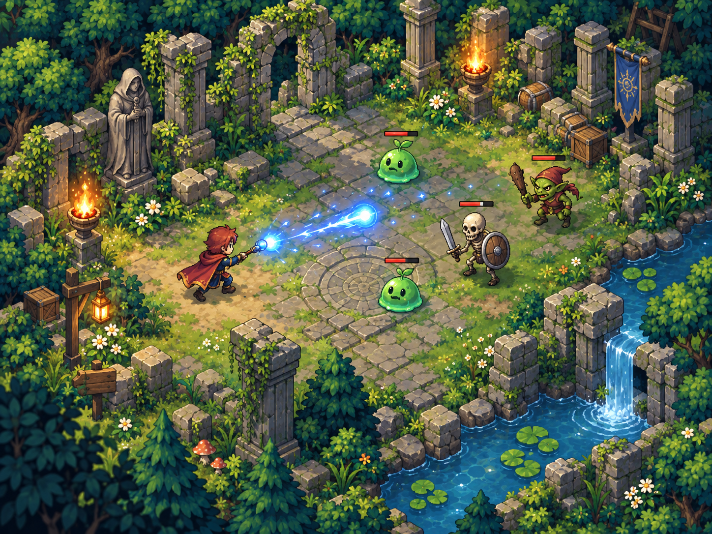
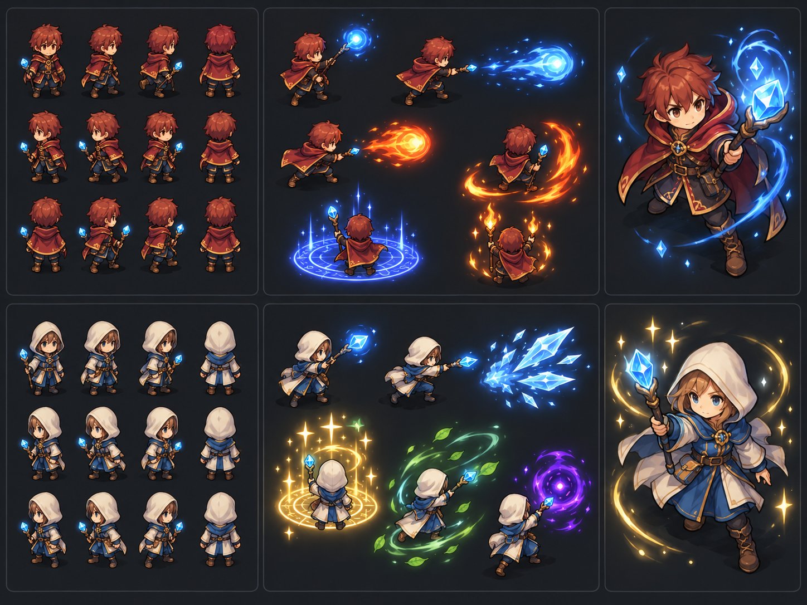
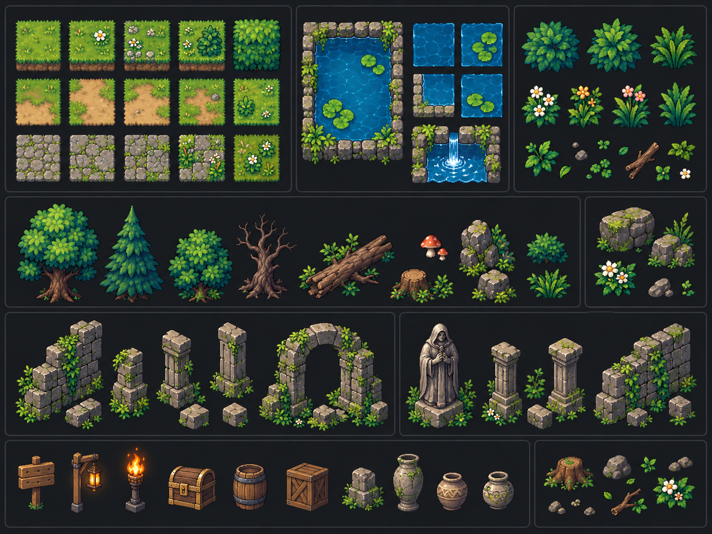
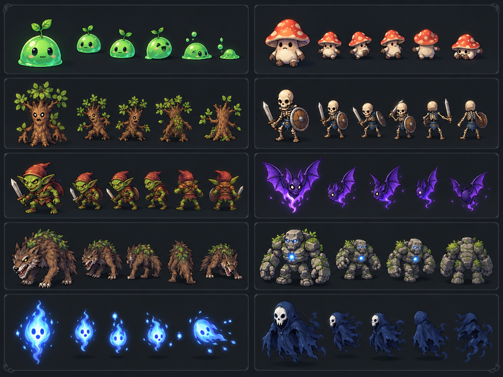
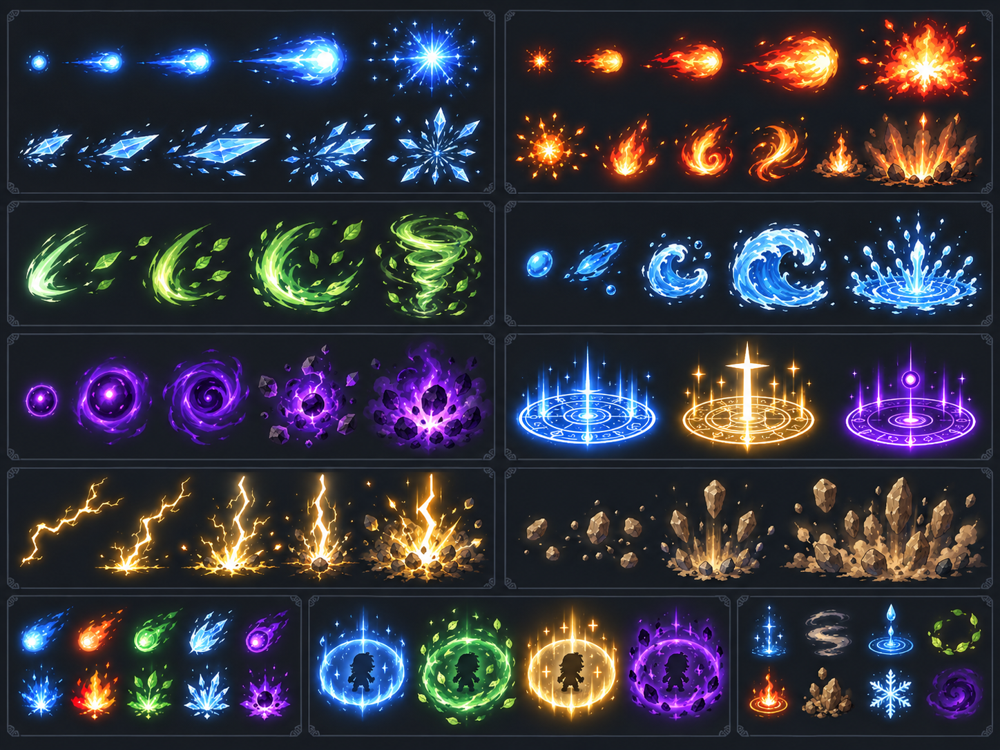

# Visual Style Reference

Use this page when authoring game-facing art, VFX, tiles, UI previews, or
screenshots. These images establish target direction; they do not prescribe
exact asset dimensions or final production content.

## Overall Direction

- Readable, high-saturation 2D pixel art viewed from a three-quarter top-down
  angle.
- Warm stone, green overgrowth, and blue water form environment base.
- Player, enemies, projectiles, and hazards must separate through value,
  silhouette, and colour before detail.
- Play space stays open and calm enough for dense combat effects.

## Characters

- Use compact, strongly posed sprites with clear front, back, and side-facing
  reads.
- Keep heads, weapons, hands, and cast direction legible at gameplay scale.
- Player palette is warm red, brown, and gold, with bright blue as familiar
  magic accent.
- Use a darker outline and small bright highlights to preserve sprite clarity
  against varied ground.

## Environment And Props

- Ground tiles use muted, repeatable texture. Do not give ordinary floor tiles
  stronger contrast than actors or pickups.
- Build ruins from mossy grey stone, warm torchlight, dense foliage, and small
  hand-placed props such as crates, banners, and lanterns.
- Reserve bright water, fire, flowers, and gold for landmarks and framing.
- Keep collision boundaries visually obvious: walls, deep water, cliffs, and
  dense props need a distinct edge from walkable ground.

## Mobs

- Each mob family needs a unique silhouette and dominant palette: green slime,
  red mushroom, bone-white skeleton, green goblin, violet bat, brown treant,
  stone golem, or blue wraith.
- Small variants may share a family palette, but must retain a readable shape
  at combat zoom.
- Hostile forms should contrast with player red/brown and common blue magic.
- Health bars, hit flashes, and status marks sit above sprites without hiding
  faces, weapons, or attack wind-up.

## Skills And Effects

- Effects use a bright core, coloured trail or aura, and limited transparent
  edge detail.
- Blue reads as arcane/ice, orange-red as fire, green as nature/poison,
  violet as void, and gold/white as holy or high-impact neutral magic.
- Match effect direction, spread, and duration to gameplay geometry: projectiles
  point along travel, cones show source direction, and AOEs keep readable rims.
- Do not let long-lived effects cover target silhouettes, health bars, or
  incoming projectile paths.
- Escalate power through size, density, motion, and brief impact flashes;
  preserve a clean centre for targeting clarity.

## Combat Readability Checks

- At expected camera zoom, distinguish player, each enemy family, projectile,
  AOE boundary, pickup, and blocking terrain in a single glance.
- Prefer hue and silhouette differences; do not rely only on animation or text.
- In high-projectile scenes, dim secondary particles before dimming impact,
  hazard boundary, or target feedback.
- Keep UI and debug overlays visually separate from authored pixel-art assets.

## Asset Use

The reference PNGs are stored beside this page. Link to them with relative
paths so this document continues to render in repository viewers and generated
documentation.
